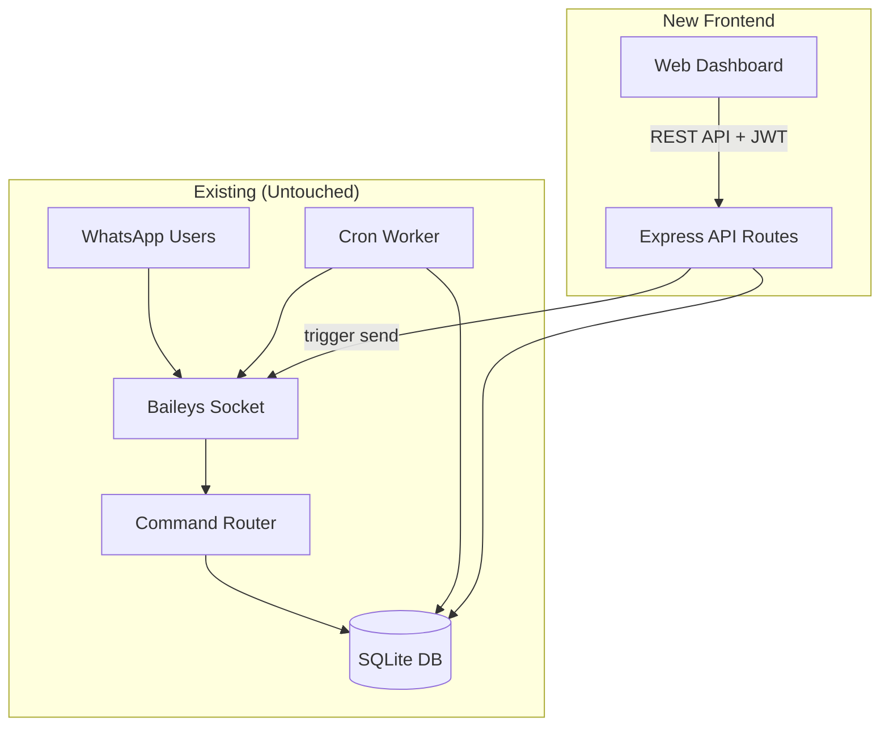

# CRB Frontend Dashboard — Implementation Plan

## Overview

Build a full-featured web dashboard alongside the existing WhatsApp bot. The backend Express server gets new REST API routes for authentication, CRUD, and admin management. The frontend is a Vite + React SPA served from `frontend/` with JWT-based auth.

---

## Architecture



## Role Hierarchy

| Role | Can Login? | Dashboard Access | Capabilities |
|------|-----------|-----------------|--------------|
| **Super Admin** (owner) | ✅ | Full | Everything + manage admins |
| **Admin** | ✅ | Full | Events, groups, CRs, broadcast, triggers |
| **CR** | ✅ | Limited | View events, add events, trigger broadcast |

- The **owner** (from `.env OWNER_NUMBERS`) is auto-seeded as super_admin on first startup.
- Super admins create admin accounts via the dashboard.
- Admins create CR accounts via the dashboard.
- CRs cannot access the admin management panel.
- No public registration.

---

## Backend Changes

### 1. New Database: `web_users` Table

```sql
CREATE TABLE IF NOT EXISTS web_users (
  id INTEGER PRIMARY KEY AUTOINCREMENT,
  username TEXT UNIQUE NOT NULL,
  password_hash TEXT NOT NULL,
  display_name TEXT NOT NULL,
  role TEXT NOT NULL DEFAULT 'cr',  -- 'super_admin' | 'admin' | 'cr'
  phone TEXT,                       -- optional link to WhatsApp phone
  created_by INTEGER,
  is_active INTEGER DEFAULT 1,
  created_at DATETIME DEFAULT CURRENT_TIMESTAMP,
  last_login DATETIME
);
```

### 2. New Files

| File | Purpose |
|------|---------|
| `src/database/userRepo.js` | CRUD for `web_users` table |
| `src/server/auth.js` | JWT sign/verify, password hashing (bcrypt), middleware |
| `src/server/apiRoutes.js` | All new REST API routes (events, groups, admins, users, broadcast, health) |
| `src/server/seedOwner.js` | Auto-seeds the owner as super_admin on first boot |

### 3. API Endpoints

#### Auth
| Method | Endpoint | Role | Description |
|--------|----------|------|-------------|
| POST | `/api/auth/login` | Public | Login with username + password, returns JWT |
| GET | `/api/auth/me` | Any | Returns current user info from JWT |
| POST | `/api/auth/change-password` | Any | Change own password |

#### Events
| Method | Endpoint | Role | Description |
|--------|----------|------|-------------|
| GET | `/api/events` | Any | List upcoming events (already exists, keep as-is) |
| GET | `/api/events/:id` | Any | Get single event with reminders |
| POST | `/api/events` | CR+ | Create new event + schedule reminders |
| PUT | `/api/events/:id` | CR+ | Update event fields |
| POST | `/api/events/:id/cancel` | CR+ | Cancel event |
| DELETE | `/api/events/:id` | Admin+ | Hard delete event |
| POST | `/api/events/:id/trigger` | CR+ | Trigger immediate broadcast to WhatsApp |

#### Groups
| Method | Endpoint | Role | Description |
|--------|----------|------|-------------|
| GET | `/api/groups` | Any | List groups (already exists) |
| PUT | `/api/groups/:jid/default` | Admin+ | Set default group |
| PUT | `/api/groups/:jid/alias` | Admin+ | Set group alias |
| POST | `/api/groups/sync` | Admin+ | Force re-sync from WhatsApp |

#### Admin Panel (User Management)
| Method | Endpoint | Role | Description |
|--------|----------|------|-------------|
| GET | `/api/users` | Admin+ | List all dashboard users |
| POST | `/api/users` | Admin+ (CR) / SuperAdmin (Admin) | Create new user |
| PUT | `/api/users/:id` | Admin+ | Update user |
| DELETE | `/api/users/:id` | Admin+ | Deactivate user |

#### WhatsApp Admins (Bot phone whitelist)
| Method | Endpoint | Role | Description |
|--------|----------|------|-------------|
| GET | `/api/admins` | Admin+ | List WhatsApp authorized phones |
| POST | `/api/admins` | Admin+ | Add authorized phone |
| DELETE | `/api/admins/:phone` | Admin+ | Remove authorized phone |

#### System
| Method | Endpoint | Role | Description |
|--------|----------|------|-------------|
| GET | `/api/health` | Public | Bot health + stats (existing, enhanced) |
| GET | `/api/stats` | Any | Dashboard statistics |

### 4. Dependencies to Add (Backend)

```
bcrypt        — password hashing
jsonwebtoken  — JWT auth tokens
cors          — cross-origin for dev
```

---

## Frontend (Vite + React)

### Tech Stack
- **Vite** — build tool
- **React 19** — UI
- **React Router v7** — client routing
- **Vanilla CSS** — styling (dark theme, glassmorphism, gradients)
- **Lucide React** — icons

### Pages & Components

| Page | Route | Role | Description |
|------|-------|------|-------------|
| Login | `/login` | Public | Username + password login form |
| Dashboard | `/` | Any | Overview: stats cards, upcoming events timeline, bot status |
| Events | `/events` | Any | Filterable event table with actions |
| Add Event | `/events/new` | CR+ | Form to create CT/Assignment/Lab/Broadcast |
| Edit Event | `/events/:id/edit` | CR+ | Pre-filled form to modify event |
| Groups | `/groups` | Admin+ | Manage WhatsApp groups, set default, aliases |
| Users | `/users` | Admin+ | Manage dashboard accounts (admins see CRs, super_admin sees all) |
| WhatsApp Admins | `/wa-admins` | Admin+ | Manage bot-authorized phone numbers |
| Settings | `/settings` | Admin+ | Bot config, owner info |

### Design System
- **Dark mode** primary with deep navy/charcoal backgrounds
- **Accent**: Vibrant teal/cyan gradient (`#06b6d4` → `#8b5cf6`)
- **Cards**: Glassmorphism with backdrop-blur, subtle borders
- **Typography**: Inter font from Google Fonts
- **Micro-animations**: Fade-in on mount, hover scale on cards, pulse on live status
- **Responsive**: Mobile-first grid, collapsible sidebar

---

## Implementation Steps

### Phase 1: Backend API Layer
1. Add `bcrypt`, `jsonwebtoken`, `cors` dependencies
2. Create `web_users` table in `db.js`
3. Implement `userRepo.js` (CRUD for web_users)
4. Implement `auth.js` (JWT middleware, password hashing, login logic)
5. Implement `seedOwner.js` (auto-create super_admin from OWNER_NUMBERS on first boot)
6. Implement `apiRoutes.js` (all REST endpoints with role-based guards)
7. Wire `apiRoutes` into existing `app.js` server
8. Add `JWT_SECRET` to `.env`

### Phase 2: Frontend Scaffold
1. Initialize Vite + React in `frontend/`
2. Set up project structure (pages, components, hooks, utils, styles)
3. Implement CSS design system (variables, utilities, glassmorphism, animations)
4. Build auth context + protected routes + API client

### Phase 3: Frontend Pages
1. Login page
2. Dashboard (stats overview + upcoming events)
3. Events page (table + filters + actions)
4. Add/Edit event forms
5. Groups management page
6. Users management page
7. WhatsApp admins page

### Phase 4: Integration & Polish
1. Wire trigger/broadcast to WhatsApp socket
2. Add toast notifications
3. Responsive polish
4. Error handling & loading states

---

> [!IMPORTANT]
> The existing WhatsApp bot functionality (DM commands, group listening, reminder scheduler) remains **completely untouched**. The frontend is an additive layer that shares the same SQLite database and can trigger the same WhatsApp socket for broadcasts.
